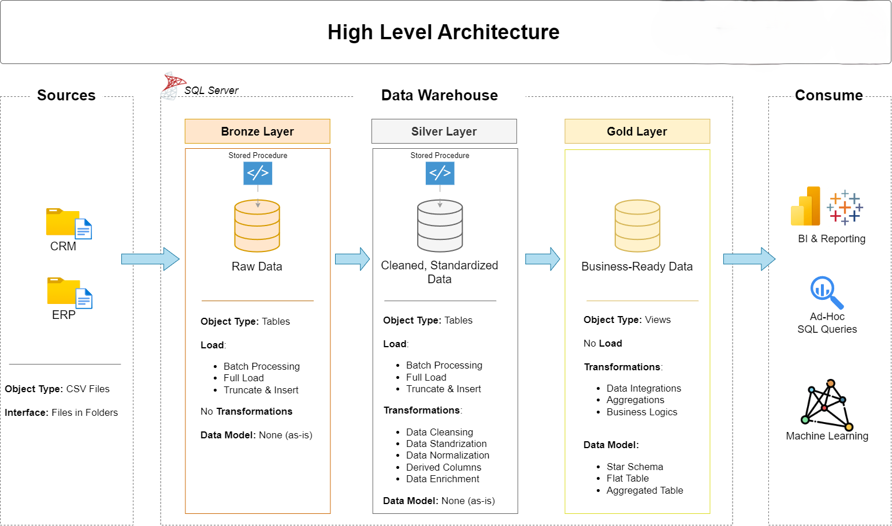
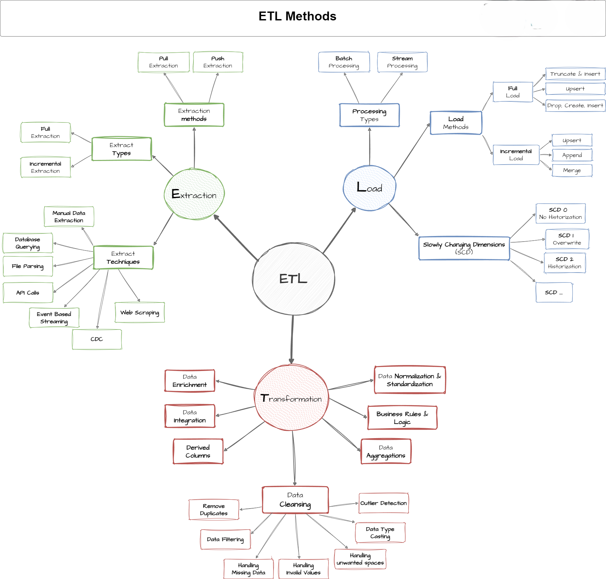
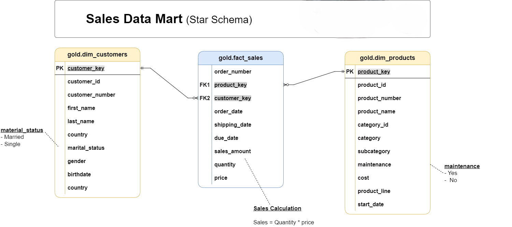
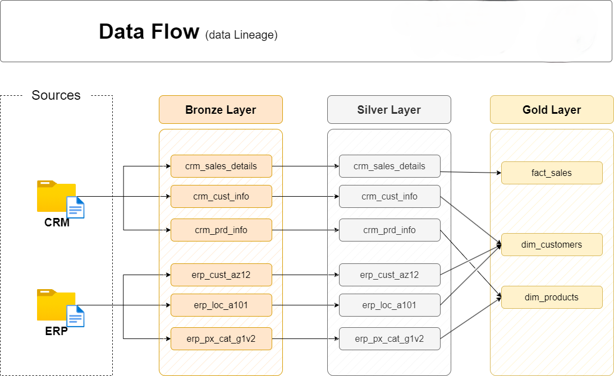
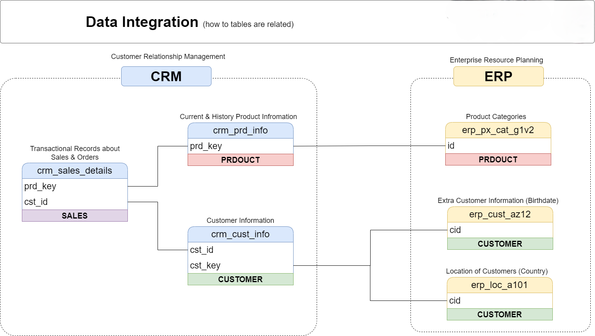

# Data Warehouse & Analytics Project 🚀

Welcome to my **Data Warehouse and Analytics Project**!  
This project demonstrates a **complete end-to-end data engineering workflow**, from raw data ingestion to gold-layer analytics tables, following **industry best practices**. It is designed as a **portfolio project** to showcase my skills as an aspiring Data Engineer.

---

## 🏗️ Data Architecture: Medallion Layers

The project implements a **Medallion Architecture**:

- **Bronze Layer (Raw Data):** Stores raw CSV files from CRM and ERP source systems as-is in SQL Server.  
- **Silver Layer (Cleaned & Standardized):** Cleanses, normalizes, and transforms data for consistency and usability.  
- **Gold Layer (Analytics-Ready):** Business-ready tables modeled in a **star schema**, optimized for analytical queries and reporting.

---

## 📖 Project Overview

**Key Objectives:**

1. **Data Engineering:** Build a modern data warehouse consolidating CRM and ERP data.  
2. **ETL Pipelines:** Extract, transform, and load data from CSVs into SQL Server.  
3. **Data Modeling:** Create fact and dimension tables optimized for analytical queries.  
4. **Analytics & Reporting:** Deliver actionable insights on customer behavior, product performance, and sales trends.

---

## 📂 Repository Structure

data-warehouse-project/
│
├── datasets/ # Raw datasets (CRM and ERP)
│ ├── source_crm/
│ └── source_erp/
│
├── docs/ # Project documentation & diagrams
│ ├── etl.png # ETL process diagram
│ ├── data_architecture.png # Architecture diagram
│ ├── data_catalog.md # Dataset catalog and metadata
│ ├── data_flow.png # Data flow diagram
│ ├── data_models.png # Star schema / data models
│ └── naming-conventions.md # Table/column naming guidelines
│
├── scripts/ # SQL scripts for ETL & transformations
│ ├── bronze/ # Load raw data
│ ├── silver/ # Data cleaning & transformations
│ └── gold/ # Analytics tables / star schema creation
│
├── tests/ # Sample queries and test scripts
├── README.md # Project overview & instructions
├── .gitignore # Files to ignore in Git
└── requirements.txt # Project dependencies

---

## ✅ Skills Demonstrated

- **SQL & ETL Pipelines:** Extract, transform, load workflows  
- **Data Modeling:** Star schema design for analytical efficiency  
- **Data Warehousing:** Bronze → Silver → Gold layer implementation  
- **Data Analysis:** SQL-based reporting on sales, products, and customer behavior  
- **Documentation:** Data catalogs, diagrams, naming conventions  

---

## ⚙️ How to Run / Test

1. Clone the repository:  
git clone https://github.com/SayyadParvej/sql-data-warehouse-project.git

2. Import CSV files from datasets/source_crm and datasets/source_erp into SQL Server.

3. Run SQL scripts in sequence:

   scripts/bronze/ → load raw CSVs

   scripts/silver/ → clean and transform data

   scripts/gold/ → create analytics-ready tables

4. Use the tests/ folder for sample queries and validation.

5. Refer to docs/ for diagrams and data flow understanding.

---

📊 Diagrams & Visuals

-ETL Process: 

-Data Model: 

-Data Flow Diagram: 

-Data Integration:  

---

💡 Notes for Recruiters

Even without a live dashboard, this repository demonstrates:
-End-to-end data engineering and data warehousing workflow
-Integration of multiple source systems (CRM & ERP)
-ETL, transformation, and analytics-ready modeling
-Professional documentation and diagrams
-This project reflects practical, hands-on skills applicable to real-world data engineering roles

---

🛡️ License

This project is licensed under the MIT License.
You are free to use, modify, and share this project with proper attribution.

